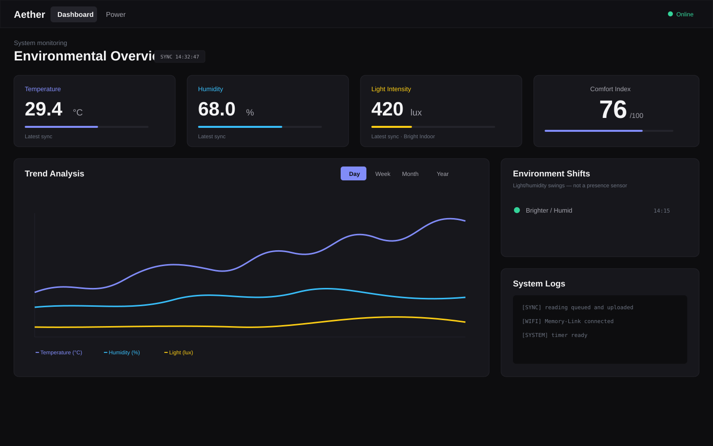
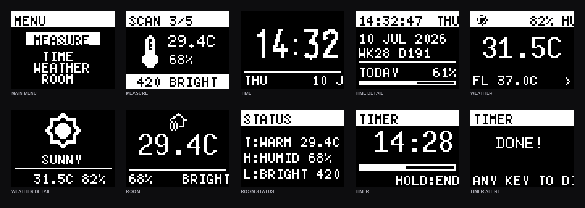

# AETHER_OS

> **An ESP32 room monitor with a tactile OLED interface, resilient telemetry, and a live digital twin.**



AETHER_OS turns an ESP32 into a small, sleep-efficient room companion. It
measures temperature, humidity, and light; presents them through a purpose-built
64×48 OLED interface; preserves readings when WiFi is unavailable; and syncs
the result to a Supabase-backed Next.js dashboard and Telegram bot.

> [!NOTE]
> The dashboard image is a current interface preview. OLED previews are rendered
> through U8g2's actual 64×48 framebuffer, fonts, and firmware XBM icon arrays,
> then scaled with nearest-neighbor pixels. They intentionally replace older
> physical-device photos that no longer match the firmware.

## At a glance

| Local device | Cloud & companion |
| --- | --- |
| Dual-core ESP32 user interface and telemetry worker | Next.js 16 / React 19 dashboard with Supabase Realtime |
| 64×48 monochrome OLED with menu, detail views, timer, and alert states | PWA metadata for home-screen installation |
| Deep sleep, fast Memory-Link WiFi reconnect, NVS-backed offline queue | Telegram commands for status, stats, and reports |

## OLED experience



The main views keep the most useful number prominent. Short taps open detail
views where information needs more space; long presses leave a screen or confirm
an action.

| Main menu item | What it does | Controls | Network |
| --- | --- | --- | --- |
| **MEASURE** | Takes five sensor samples, averages them, and syncs the result | Long press to start; long press during sampling exits | Optional: queues reading offline |
| **TIME** | Large local clock with date strip | Short tap opens Time Detail; long press exits | NTP only when time has not been synced |
| **WEATHER** | Temperature, humidity, and feels-like temperature | Short tap opens full-size condition icon/detail; long press exits | Yes |
| **ROOM** | Instant local room snapshot | Short tap opens Room Status; long press exits | No |
| **LOCATE** | Resolves city and UTC offset for Time/Weather | Opens location lookup result | Yes |
| **TREND** | On-device recent Temperature / Humidity / Light sparklines | Short tap cycles metrics; long press exits | No |
| **TIMER** | 5 / 10 / 15 / 25 / 30 minute countdown | Short tap changes preset; long press starts, cancels, or exits | No |
| **LED** | Toggles ambient RGB LED behavior | Long press toggles | No |
| **INTERVAL** | Cycles automatic measurement interval: 5m / 15m / 30m / 60m | Long press cycles | No |
| **WIFI MENU** | Opens provisioning, saved-network selection, and credentials reset | Long press opens | Local AP for portal |
| **STATS** | Displays device measures, boots, and accumulated runtime | Long press opens | No |
| **RESET STATS** | Clears lifetime statistics after confirmation | Long press confirms | No |
| **DEEP SLEEP** | Starts the low-power sleep sequence immediately | Long press activates | No |

### Timer & alerts

The countdown timer persists through deep sleep. It checks for expiry when the
device wakes and while the menu is open. On completion, it shows a timer-done
screen and flashes the LED alert even if ambient LED mode is disabled.

## Digital twin dashboard

The dashboard provides a current environmental overview alongside longer-term
patterns:

- **Live KPIs** for temperature, humidity, light, and comfort
- **Trend analysis** with time-based smoothing, responsive mobile layout, and
  1-decimal-point tooltips
- **Comfort heatmap** for the current year, with future dates omitted and a
  phone-friendly horizontal grid
- **Power view** for session/runtime behavior
- **Environment shifts** that honestly report light/humidity changes rather
  than claiming a real occupancy sensor
- **Offline reading recovery**: queued readings flush when the device reconnects
- **PWA support**: install the dashboard from a mobile browser's “Add to Home
  Screen” action

## System architecture

```text
┌──────────────────────┐       ┌───────────────────────┐
│      ESP32 device    │       │       Supabase         │
│                      │ HTTPS │  room_readings         │
│ Core 0: OLED UI      ├──────►│  device_sessions       │
│ Core 1: sensors/WiFi │       │  device_logs           │
│ NVS + deep sleep     │       └──────────┬────────────┘
└──────────────────────┘                  │ Realtime / REST
                                           ▼
                          ┌────────────────────────────────┐
                          │ Next.js dashboard + Telegram bot │
                          │ PWA · analytics · reports        │
                          └────────────────────────────────┘
```

### Built for unreliable connectivity

1. **Memory-Link WiFi** remembers BSSID, channel, and static-IP context for
   faster reconnection after deep sleep.
2. **Offline reading queue** stores up to 20 readings in binary NVS when WiFi
   is down, then flushes them on the next successful sync.
3. **Session log queue** retains runtime sessions independently, so lifecycle
   data can recover after an outage.
4. **Binary NVS structs** keep persistent data compact and avoid JSON parsing
   on the device.

## Quick start

### Prerequisites

- ESP32 Dev Module
- PlatformIO / VS Code for firmware work
- Node.js 20+ for the dashboard
- A Supabase project

### 1. Clone and configure

```bash
git clone https://github.com/CPLADRAGON/Aether-OS.git
cd Aether-OS
```

Run [`supabase_schema.sql`](supabase_schema.sql) in the Supabase SQL editor.
If your project predates the lux update, also run:

```sql
ALTER TABLE room_readings
ADD COLUMN IF NOT EXISTS lux_value FLOAT;
```

Create the local secret files (they are intentionally ignored by Git):

```text
firmware/include/secrets.h
dashboard/.env.local
```

### 2. Flash firmware

```bash
cd firmware
pio run
pio run -t upload
pio device monitor
```

### 3. Run dashboard

```bash
cd dashboard
npm install
npm run dev
```

For wiring, deployment, Supabase configuration, and the full hardware guide,
see [DEPLOYMENT.md](DEPLOYMENT.md).

## Technology

| Layer | Stack |
| --- | --- |
| Firmware | ESP32, Arduino, FreeRTOS, PlatformIO, U8g2 |
| Sensors | DHT11, LDR, optional MPU6050 |
| Data | Supabase Postgres, REST, Realtime |
| Dashboard | Next.js 16, React 19, Tailwind CSS v4, ECharts |
| Companion | Telegram bot via Next.js route handler |

## Security note

The included Supabase policies are deliberately permissive for prototyping.
Add authentication and tighter Row Level Security policies before exposing
personal or sensitive room data publicly.

## License

See [LICENSE](LICENSE).
