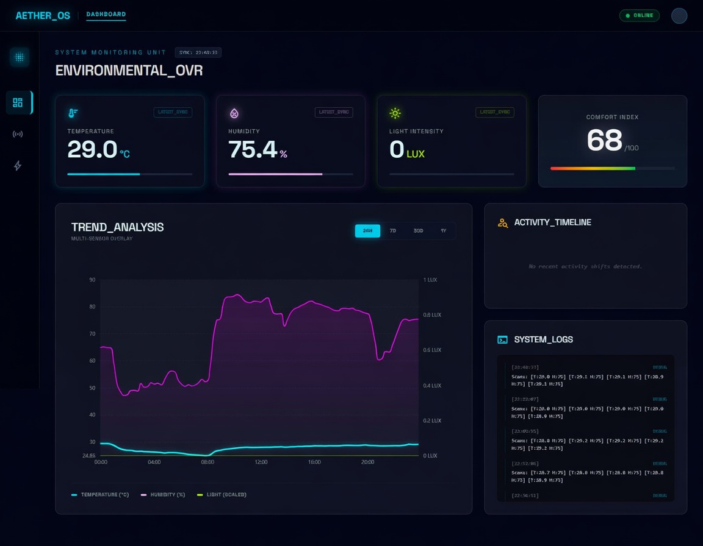

# AETHER_OS: Advanced Environmental Telemetry & Habitability Engine

A high-performance, dual-core embedded system for real-time environmental monitoring and cloud-synchronized data visualization. AETHER_OS leverages the ESP32 architecture to deliver a "Liquid UI" experience alongside robust data telemetry to a Supabase-backed Digital Twin dashboard.

## Project Showcase

> [!TIP]
> **Experience the Aether Ecosystem in Action**
> Watch the full video to see the "Liquid UI" system, the sub-500ms WiFi handshake, and the real-time Digital Twin synchronization between the ESP32 and the cloud dashboard.

---

## Performance Engine: "Zero-Wait" Architecture

AETHER_OS is engineered for maximum performance and Flash longevity through a custom-built binary storage engine.

- **Binary NVS Structs**: Replaced heavy JSON strings with packed C-structs in Non-Volatile Storage. This eliminates parsing overhead and reduces Flash wear.
- **Dynamic Sleep Intervals**: User-selectable power profiles (5m, 15m, 30m, 1h) toggleable directly from the main menu via long-press. Selection is persisted in binary NVS.
- **Sub-500ms WiFi (Memory-Link)**: Uses BSSID pinning and static IP snapshots to bypass DHCP handshakes, achieving cloud connectivity in under 500ms from boot.
- **Stealth Mode**: Intelligent early-boot LED and sensor management to minimize current draw and maximize battery life.
- **Fail-Safe Log Queue**: A 10-entry cyclic binary queue ensures session data survives even if the device reboots while offline.

## Aether Telegram Report Center

The system is paired with an interactive Telegram mascot that provides real-time access to your environmental data.

- **Interactive Reports**: Request 24-hour, 7-day, 30-day, or 1-year environmental summaries via inline buttons.
- **Efficiency Index**: Real-time reporting on the device's sync efficiency and network latency.
- **Mascot Persona**: A custom-themed interactive bot that acts as your system's digital companion.

## Digital Twin Dashboard 2.0

The AETHER Dashboard is a premium, glassmorphism-inspired Next.js application designed for strict dark mode aesthetics.

### Advanced Analytics Features

- **KPI Dashlets**: Real-time tracking of Accumulated Uptime, Mean Session Duration, and Device Lifecycle (Boot/Sync indices).
- **Active Profile Badge**: Remote confirmation of the device's selected sleep interval (e.g., 15m Interval).
- **Efficiency Index**: A performance metric calculated against an 18s ideal sync baseline.
- **Session Volatility Index**: ECharts-powered bar charts highlighting network/sensor lag in amber/red if thresholds are exceeded.
- **Uptime Accumulation Plot**: A "Cyan Glow" area chart showing the growth of tracked runtime over time.
- **Singapore Time (SGT) Sync**: All data is automatically localized for SGT (UTC+8) synchronization.

## System Architecture

AETHER_OS utilizes a distributed computing model to ensure UI responsiveness never compromises sensor precision or network reliability.

### Dual-Core Processing Logic

1. **The Painter Core (Core 0)**: Dedicated to the "Liquid UI" engine. It manages high-frequency display updates, mechanical animations, and the SSD1306 OLED interface.
2. **The Worker Core (Core 1)**: Handles telemetry tasks, including I2C sensor sampling, binary NVS management, and secure SSL/TLS communication with Supabase.

## Technical Specifications

- **MCU**: ESP32 Dual-Core (240MHz) with NVS Binary Struct Optimization.
- **Sensors**: DHT11 (Temp/Hum), MPU6050 (Motion/Tilt).
- **Cloud Interface**: Supabase REST API (PostgreSQL) with Row-Level Security (RLS).
- **Telegram Logic**: Next.js API Routes (Vercel) with Webhook Integration.
- **Visualization**: Next.js 14, Tailwind CSS, ECharts-for-React, Framer Motion.
- **Power Management**: ESP32 Deep Sleep (Timer/Ext0 Wakeup) with Runtime Tracking.

---

## Getting Started

Follow our comprehensive [Deployment & DIY Guide](DEPLOYMENT.md) to build your own unit.

### Quick Start

1. **Clone**: `git clone https://github.com/CPLADRAGON/Aether-OS.git`
2. **Backend**: Run `supabase_schema.sql` in your Supabase SQL Editor.
3. **Configure**: Update `firmware/include/secrets.h` and `.env.local`.
4. **Flash**: Upload via PlatformIO.
5. **Monitor**: Access your dashboard or interact via the Telegram bot.

## Development Environment

Built using the PlatformIO ecosystem within VS Code.

- **Framework**: Arduino / ESP-IDF
- **Dashboard**: React 18+ with strict TypeScript and Tailwind CSS.
